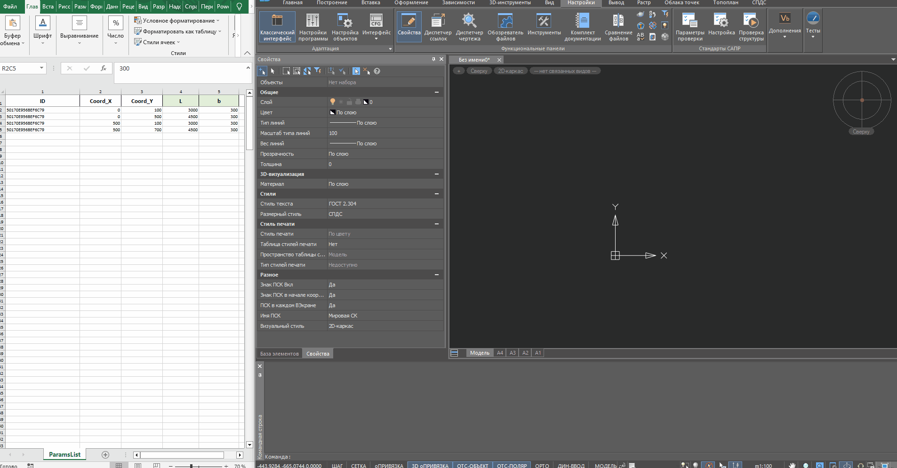

### Назначение:
Создание СПДС объектов в пространстве модели по таблице Excel.

#### Логика работы:
1. Скрипт читает указанный файл Excel.
2. В файле должны быть указаны: 
	* ID объектов (из базы СПДС)
	* координаты вставки 
	* параметры объекта которые необходимо применить к объекту. 
3. Одна строка файла равно один объект СПДС.
4. Объект по ID ищется в БД СПДС, к нему применяются параметры.
5. Объект вставляется по координатам.

#### Важно:

1. Структура таблицы должна быть как в /DemoFiles. Кол-во параметров можно расширять вправо.
2. ID и параметры можно найти в "Мастер объектов" СПДС.
3. Чтение Excel реализовано через Open XML библиотеки. 
    DocumentFormat.OpenXml.dll - должна находится в папке со основной dll.

P.S. часть парметров объекта "вид" и "имплементация" жестко прописана в коде

#### Пример:

